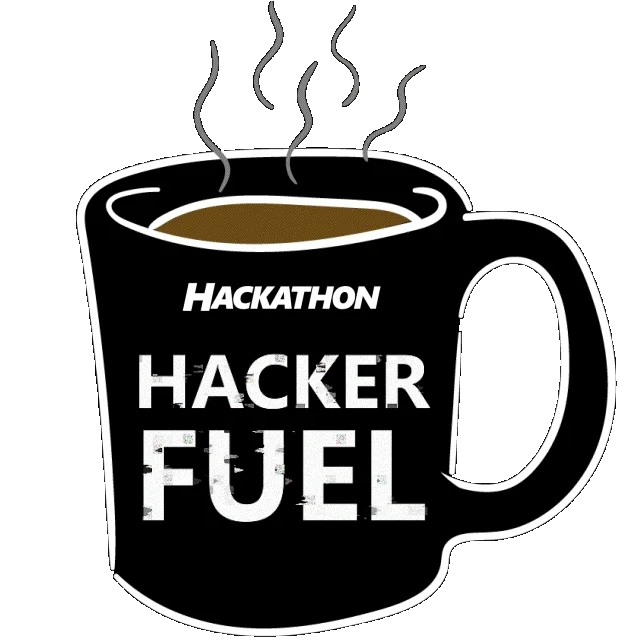
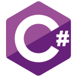

   
  

    
  

  
  <b>@abdulkadir-gungor</b> 

   
  

    
    
    
  

  

     
  

   

 

### :man_technologist: About Me : 
- 👋 Hi, I’m @abdulkadir-gungor
- 👀 I’m interested in "Cyber Security", "Malware Analysis" and "Data Analysis"
- 🌱 I’m currently learning Assembly, C, Java, Python, Ruby, Matlab, Linux Kernell, Windows Kernel etc.
- 💞️ I’m looking to collaborate on "Cyber Security" and "Malware Analysis"
- 📫 How to reach me "abdulkadir_gungor@outlook.com"

 

### :hammer_and_wrench: Languages and Tools :

  <a href="#">
  &nbsp;
  &nbsp;
  &nbsp;
  &nbsp;
  &nbsp;
  &nbsp;
  &nbsp;
  &nbsp;
  &nbsp;
  &nbsp;
  &nbsp;
  &nbsp;
  &nbsp;
  &nbsp;
  &nbsp;
  &nbsp;
  &nbsp;
  &nbsp;
  &nbsp;
  &nbsp;
  &nbsp;
  &nbsp;
  </a>

  
   
 

  

    
  

 

### 📝 🇹🇷   Turkish Documents :
  &emsp;You can access some of the documents I have prepared from the link below.
  
  &emsp;[Hazırladığım bazı dökümanlara aşağıdaki linkten ulaşabilirsiniz.]
   
   - Block Zinciri Teknolojisi
   - Malware Analizi: Örnek Bir Uygulama Geliştirmesi ve Değerlendirmesi
   - Bir Siber Saldırı Senaryousu
   - Snort Programı
   - USB Belleğin FTK Imager Programı ile İncelenmesi
   - Veritabanı: MySQL Uygulaması
   - Yapay Zekanın Kullanım Alanları ve Geleceği
   
  &emsp; ***...***
   
  

    &emsp;
    
 
 

### 📚 🇹🇷   Turkish Books :
  - ISBN:9786254093784 ***"Linux İşletim Sisteminde Malware Analizi"*** [March/2021] &emsp; 
    
  - ISBN:9786250009277 ***"Windows İşletim Sistemlerinde Malware Analizi"*** [October/2022] &emsp; 
    
    
 
 

  

